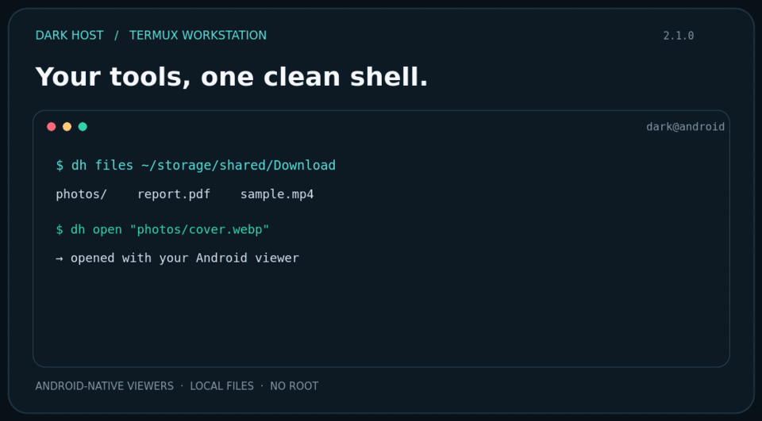

# DARK HOST

### A focused workstation layer for Termux



Dark Host gives Termux a distinctive shell, a compact command center, and short commands for the work that usually means switching between tools. It stays on Bash: Android still handles your browser, media player, and file viewers, while Termux runs your code and local development servers.

```text
 ◇ DARK HOST  /  WORKSPACE
  dark@android · ~/projects/site
  dh run index.html
  Local URL: http://127.0.0.1:8000/index.html
  dh serve --stop 8000
```

## Install

In Termux:

```bash
pkg update
pkg install git
git clone https://github.com/mbidark/Termux-theme.git ~/Dark
cd ~/Dark
chmod +x ./*.sh
./install.sh
```

Restart Termux after the installer finishes. It saves its files under `~/.darkhost/` and backs up existing shell and Termux settings under `~/.dark-backup/`. Upgrades preserve your existing Bash and Termux configuration.

## Work from one command line

| Task | Command |
| --- | --- |
| Open a photo, video, document, or folder | `dh open "path/to/file"` |
| List a directory | `dh files [path]` |
| Open a website in the device browser | `dh browse example.com` |
| Play a local audio/video file or URL | `mp "path-or-url"` |
| Run a Python, Node.js, PHP, or Bash file | `dh run script.py [args...]` |
| Preview a static HTML page | `dh run index.html [port]` |
| Start a static local web server | `dh serve [directory] [port]` |
| Start a PHP development server | `dh serve --php [directory] [port]` |
| Launch the server URL in the browser | `dh serve --open [directory] [port]` |
| See or stop Dark Host servers | `dh serve --list` / `dh serve --stop [port]` |
| Run a project's npm script | `dh dev [directory] [script] [-- args...]` |

### Files, browser, and media

`dh open` passes local paths to Android's associated app using `termux-open`; on a Linux desktop it falls back to `xdg-open`. `dh browse` opens HTTP/HTTPS URLs and adds `https://` when you provide a hostname without a scheme. `dh files` uses `eza` when installed, otherwise a standard long listing.

Media playback remains opt-in through available tools. Install `mpv` for broader local and stream playback. Title search with `mp "search words"` needs both `yt-dlp` and `mpv`. Android playback controls (`dh media pause|stop|info`) need the Termux:API package **and its matching Android app**.

### Run code and preview websites

Install the runtimes you plan to use:

```bash
dh install python nodejs php
```

Examples:

```bash
dh run hello.py
dh run app.js
dh run report.php
dh run index.html 8081
dh serve --php ./my-site 8080
dh dev ./my-app dev -- --host 127.0.0.1
```

Static and PHP development servers bind to `127.0.0.1` by default. They are reachable from the same device's browser, not exposed to your Wi-Fi network. `dh serve --list` shows Dark Host servers started in this shell environment; stop one with `dh serve --stop 8080`. Server output is saved under `~/.darkhost/logs/`.

For a PHP website, use `dh serve --php <directory>`; `dh run file.php` executes a PHP script in CLI mode. HTML preview needs Python. The `dh dev` shortcut runs an existing `npm` script—it does not install project dependencies for you.

## The shell

- `dh` opens the status dashboard; `dh status`, `dh system`, and `dh monitor` show more detail.
- Themes: `black`, `blood`, `matrix`, `ghost`, `void`, `cyber`, and `terminal`.
- Visual modes: `normal`, `hacker`, `ghost`, `matrix`, `forensic`, `void`, and `minimal`.
- `dh settings` changes profile, prompt, mode, banner, and animation preferences.
- Tab completes Dark Host commands. Up/down searches command history. `Ctrl+Space` shows suggestions; `Ctrl+H` opens help; `Ctrl+L` clears the terminal.
- `dh doctor` checks the installation; `dh install <package>` uses the detected package manager; `dh update` checks for a fast-forward update.

Run `dh help` for the command catalog, or `dh help <command>` for details. The installed release is shown by `dh version`.

### Optional Termux tools

```bash
dh install eza mpv yt-dlp termux-api
```

`eza` and `mpv` are optional. `yt-dlp` is only needed for title-based media search. The `termux-api` command-line package requires its matching Android app for device integrations. Install only what you need.

## Customize and maintain

Settings and local server records live in `~/.darkhost/`. Run `dh settings` to configure the prompt and appearance; `dh theme matrix` switches the theme, and `dh banner off` disables the startup display.

To update an older checkout from inside Termux:

```bash
dh update
```

The updater shows the selected checkout and available version, then asks before pulling. For a non-interactive update, specify both the checkout path and confirmation:

```bash
dh update --yes "$HOME/Dark"
```

To uninstall and restore backed-up startup files:

```bash
cd ~/Dark
./uninstall.sh
```

## Security and compatibility

Dark Host is a user-space Bash customization, **not a replacement operating system, Android security boundary, or real account lock**. Its legacy sign-in feature is only a shell-level gate; credentials are stored locally and must not be reused from sensitive accounts. Keep Android's device lock enabled.

No root access is required. Package availability and media formats depend on your Termux build, device, and installed Android apps. This project does not embed a graphical browser, full-screen file manager, or media player.

## Development

Run the smoke tests from the repository checkout:

```bash
bash tests/darkhost_smoke.sh
```

The suite checks the shell commands, installer upgrade behavior, browser URL validation, code runners, and a loopback HTTP server.

**Release:** `2.1.0` · **License:** MIT
